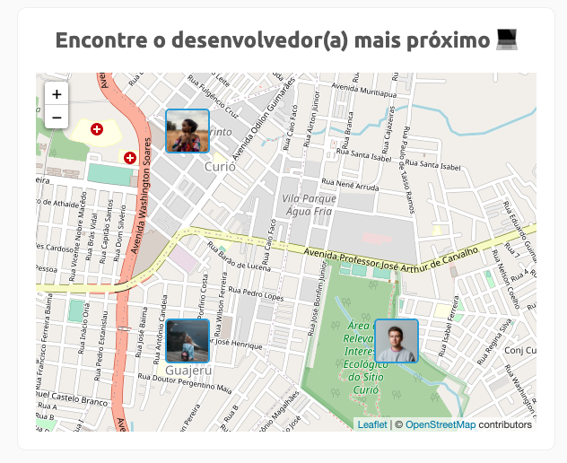
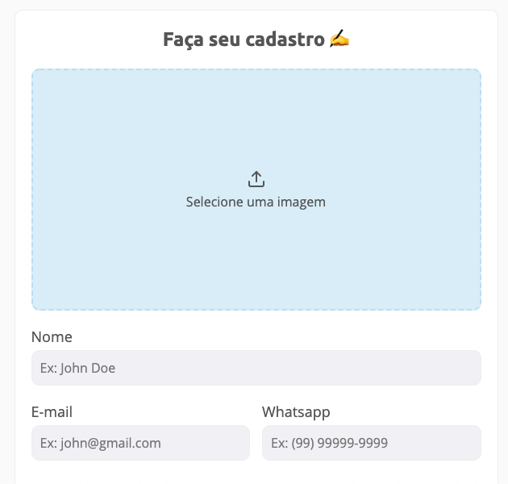

## :satellite: DevFinder

Localize desenvolvedores perto de você.






## :wrench: Configuração do banco de dados

No diretório `backend`, acesse o arquivo `knexfile.js` e configure a sua base de dados como no exemplo abaixo:

```javascript
development: {
  client: "mysql",
  connection: {
    host: "localhost",
    user: "root",
    password: "root",
    database: "devfinder"
  },
  migrations: {
    directory: `${__dirname}/src/database/migrations`,
  },
},
```

> é importante configurar corretamente o diretório das **migrations**

## :fire: Instalação

```bash
# backend
$ cd backend
$ npm install
$ npm run dev

# frontend
$ cd frontend
$ npm install
$ npm run dev
```

## :memo: Licença

Este projeto está sob a licença MIT. Veja o arquivo [LICENSE](LICENSE) para mais detalhes.
